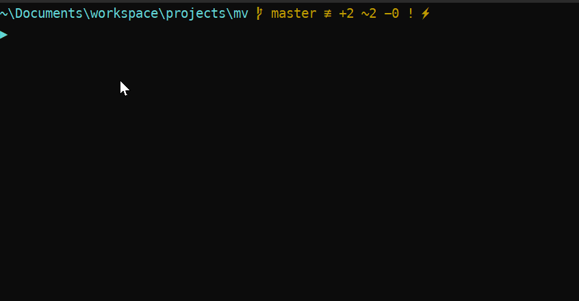

# Magistra Vitae
[](https://forthebadge.com)


The aim🎯 of this repo is to facilitate the creation of the historical consciousness of software:

> Magistra Vitae is a Latin expression, used by Cicero in his De Oratore as a personification of history, means "life's teacher". Often paraphrased as Historia est Magistra Vitae, it conveys the idea that the study of the past should serve as a lesson to the future, and was an important pillar of classical, medieval and Renaissance historiography.

— From [Magistra vitae - Wikipedia](https://en.wikipedia.org/wiki/Magistra_vitae)

This project is inspired by [Informal History Of Programming Ideas](https://wiki.c2.com/?InformalHistoryOfProgrammingIdeas). 

### 1. demo



### 2. setup
#### 2.1. prereqs
* PowerShell Core

#### 2.2. environmental variables
* you need the following envirnomental variables

Name        | Example Value
------------|-------------------------------------------------
`MV_FOLDER` | `C:\Users\Admin\Documents\workspace\projects\mv`

### 3. instructions
1. Import module into Powershell Profile — `$profile` and set alias - I am using `hmv` as `mv` is taken for `Move-Item`

```powershell
# $profile
Import-Module "${env:MV_FOLDER}\mv.ps1"
Set-Alias hmv create-event
```

2. Call it and enter `year` and `event title`: 
    - the markdown file will be created 
    - situated in respective's decade folder
    - with zettelkasten-optimized template
3. Use with other scripts from [Zettelkasten For VSCode](https://github.com/pkutaj/z4v)

### 4. sources
* [Magistra vitae - Wikipedia](https://en.wikipedia.org/wiki/Magistra_vitae)
* [Zettelkasten For VSCode](https://github.com/pkutaj/z4v)
* [Informal History Of Programming Ideas](https://wiki.c2.com/?InformalHistoryOfProgrammingIdeas)